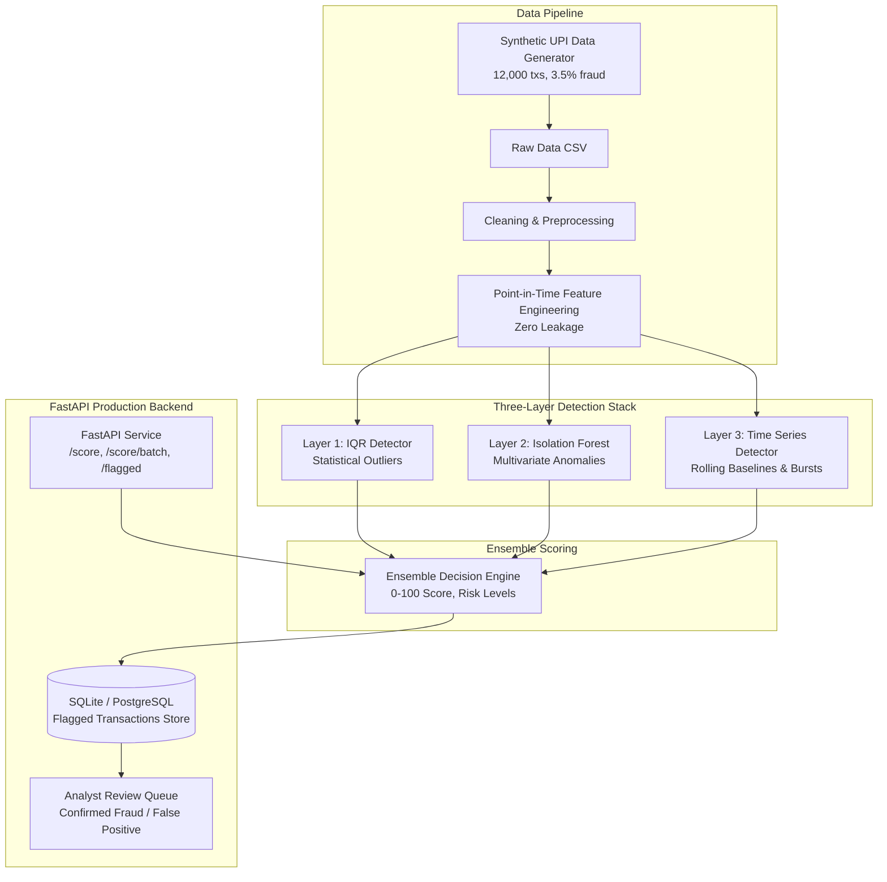

# PayWatch: Real-time UPI Fraud Detection System

[](https://www.python.org/downloads/)
[](https://fastapi.tiangolo.com)
[](https://opensource.org/licenses/MIT)
[](https://www.docker.com/)

PayWatch is a production-style, layered fraud detection platform built for Unified Payments Interface (UPI) transactions. It generates synthetic transaction data with behavioral profiles, extracts point-in-time features without look-ahead leakage, and combines three complementary detection methods—**IQR Outlier Detection**, **Isolation Forest**, and **Streaming Time Series Analysis**—into an explainable composite risk decision served through a real-time FastAPI backend.

---

## Architecture Diagram



---

## Multi-Layer Detection Methodology

| Layer | Method | Scope & Mechanics | Key Reason Codes |
| :--- | :--- | :--- | :--- |
| **Layer 1** | **IQR Outlier Detection** | Fast, explainable statistical filter flagging values outside $[Q1 - 1.5 \cdot IQR, Q3 + 1.5 \cdot IQR]$. Dual-tier: personalized per-user thresholds ($\ge 5$ txs) with global fallback. | `AMOUNT_OUTLIER`, `FREQUENCY_SPIKE`, `USER_DEVIATION_OUTLIER` |
| **Layer 2** | **Isolation Forest** | Unsupervised multivariate decision trees (150 estimators, 256 max samples). Isolates rare combinations of features without exposing ground-truth labels. | `ISO_FOREST_ANOMALY` |
| **Layer 3** | **Time Series Analysis** | Streaming sliding window (24h) computing rolling mean ($\mu$), rolling standard deviation ($\sigma$), burst counts within 5 minutes, and off-hours activity. | `TIME_SERIES_BURST`, `OFF_HOURS_BURST`, `ROLLING_AMOUNT_SPIKE` |

### Ensemble Decision Matrix
| Flags Triggered | Risk Tier | Decision Action | Fraud Score Range |
| :---: | :---: | :---: | :---: |
| **0** | `low` | `allow` | 0 – 35 |
| **1** | `medium` | `mark_for_review` | 40 – 69 |
| **2** | `high` | `escalate` | 70 – 89 |
| **3** | `critical` | `escalate_with_priority` | 90 – 100 |

---

## Evaluation & Ablation Study Results

Evaluated on a **strict chronological 75% train / 25% test split** (3,000 holdout transactions, 115 fraud cases):

| Method / Configuration | Precision | Recall | F1-Score | False Positive Rate | ROC-AUC | PR-AUC |
| :--- | :---: | :---: | :---: | :---: | :---: | :---: |
| **IQR Outlier Alone** | 48.9% | 98.3% | 0.653 | 4.09% | 0.986 | 0.857 |
| **Isolation Forest Alone** | 52.8% | 40.9% | 0.461 | 1.46% | 0.787 | 0.481 |
| **Time Series Alone** | 88.2% | 13.0% | 0.227 | 0.07% | 0.565 | 0.527 |
| **Ensemble (Review Tier / Score $\ge 40$)** | **36.8%** | **98.3%** | **0.535** | **6.72%** | **0.974** | **0.810** |
| **Ensemble (Escalate Tier / Score $\ge 70$)** | **90.2%** | **40.0%** | **0.554** | **0.17%** | **0.974** | **0.810** |

---

## Repository Structure

```
PayWatch/
├── data/                      # Raw and engineered datasets, SQLite DB
├── docs/                      # Data dictionary, evaluation report
│   ├── data_dictionary.md
│   └── evaluation_report.md
├── models/                    # Serialized joblib artifacts
│   ├── iqr_detector.joblib
│   ├── isolation_forest.joblib
│   ├── scaler.joblib
│   └── feature_names.joblib
├── src/
│   ├── config.py              # Centralized configuration loader
│   ├── ensemble.py            # Layered ensemble decision engine
│   ├── evaluate.py            # Time-series evaluation & ablation script
│   ├── api/                   # FastAPI backend
│   │   ├── main.py            # API routes and lifecycle
│   │   ├── schemas.py         # Pydantic models
│   │   ├── database.py        # SQLite SQLAlchemy engine
│   │   └── models.py          # FlaggedTransaction ORM table
│   ├── detectors/             # Detection modules
│   │   ├── iqr_detector.py
│   │   ├── iso_forest_detector.py
│   │   └── timeseries_detector.py
│   ├── features/              # Feature engineering
│   │   ├── preprocessor.py
│   │   └── user_history_tracker.py
│   └── generator/             # Synthetic UPI generator
│       └── synthetic_generator.py
├── tests/                     # 27+ automated unit & integration tests
├── config.yaml                # Model hyperparams & thresholds
├── Dockerfile                 # Production container image
├── docker-compose.yml         # Container orchestration
├── requirements.txt           # Dependencies
└── train.py                   # Model fitting pipeline
```

---

## Getting Started

### 1. Installation
Clone the repository and install dependencies:
```bash
git clone https://github.com/atharvawagh-03/PayWatch.git
cd PayWatch

python -m venv .venv
source .venv/bin/activate  # On Windows: .venv\Scripts\activate
pip install -r requirements.txt
```

### 2. Generate Data & Train Models
```bash
# 1. Generate 12,000 synthetic UPI transactions
python -m src.generator.synthetic_generator --n 12000 --fraud-rate 0.035

# 2. Train and persist detector artifacts
python train.py

# 3. Run evaluation & ablation benchmark
python -m src.evaluate
```

### 3. Run the Test Suite
```bash
pytest tests/ -v
```

### 4. Start the FastAPI Service
```bash
uvicorn src.api.main:app --host 0.0.0.0 --port 8000 --reload
```
Interactive Swagger API documentation is available at: `http://localhost:8000/docs`

---

## Running with Docker

```bash
docker-compose up --build -d
```
Verify service health:
```bash
curl http://localhost:8000/health
```

---

## API Endpoints & Usage

### 1. Health Check
```bash
curl -X GET "http://localhost:8000/health"
```

### 2. Score Single Transaction
```bash
curl -X POST "http://localhost:8000/score" \
  -H "Content-Type: application/json" \
  -d '{
    "transaction_id": "TXN_000123",
    "timestamp": "2026-10-08T02:14:00+05:30",
    "sender_id": "U_1042",
    "receiver_id": "U_8891",
    "amount": 48500,
    "merchant_category": "P2P",
    "transaction_type": "P2P",
    "location": "Nashik",
    "device_type": "web",
    "upi_channel": "intent_link"
  }'
```
**Response:**
```json
{
  "transaction_id": "TXN_000123",
  "fraud_score": 87,
  "risk_level": "high",
  "decision": "escalate",
  "reasons": ["AMOUNT_OUTLIER", "ISO_FOREST_ANOMALY", "NEW_DEVICE", "OFF_HOURS_BURST"],
  "model_version": "1.0.0"
}
```

### 3. List Flagged Transactions
```bash
curl -X GET "http://localhost:8000/flagged?risk_level=high&limit=10"
```

### 4. Analyst Review Disposition
```bash
curl -X PATCH "http://localhost:8000/flagged/TXN_000123/review" \
  -H "Content-Type: application/json" \
  -d '{
    "status": "confirmed_fraud",
    "notes": "Confirmed midnight account takeover via unrecognized web browser."
  }'
```

---

## Resume Bullets & Interview Talking Points

### Resume Bullets
- **Built an end-to-end UPI fraud detection pipeline** on 12,000 synthetic transactions using IQR statistical filtering, Isolation Forest multivariate anomaly detection, and streaming time-series analysis.
- **Engineered point-in-time behavioral features** (spend z-scores, velocity in the last hour, burst intervals, recipient repetition, device/location changes) strictly preventing look-ahead train/serve leakage.
- **Designed a multi-layer ensemble scoring engine** combining statistical and machine learning signals into transparent risk tiers (`allow`, `mark_for_review`, `escalate`, `escalate_with_priority`) and human-readable reason codes.
- **Deployed a containerized FastAPI backend (<30ms latency)** with persistent SQLite storage for flagged transactions and analyst review disposition workflows.

### Interview Talking Points
1. **Scarcity of Real Fraud Data**: Public banking data rarely includes real labeled UPI graphs due to privacy. I built a realistic generator simulating legitimate behavior, noisy edge cases (festivals, night-shift users), and sophisticated fraud archetypes (ATO, burst drains).
2. **Complementary Detection**: Single detectors fail on nuanced fraud. IQR catches extreme spikes, Isolation Forest detects multidimensional feature anomalies, and Time Series captures velocity bursts that look normal individually.
3. **Train/Serve Skew Prevention**: Feature engineering logic and state tracking are decoupled into shared modules used by both the offline training pipeline and online API requests.
4. **Explainability**: Financial regulations require reason codes. PayWatch provides transparent codes (`AMOUNT_OUTLIER`, `TIME_SERIES_BURST`, `OFF_HOURS_BURST`) so analysts can immediately understand the system's decision.
